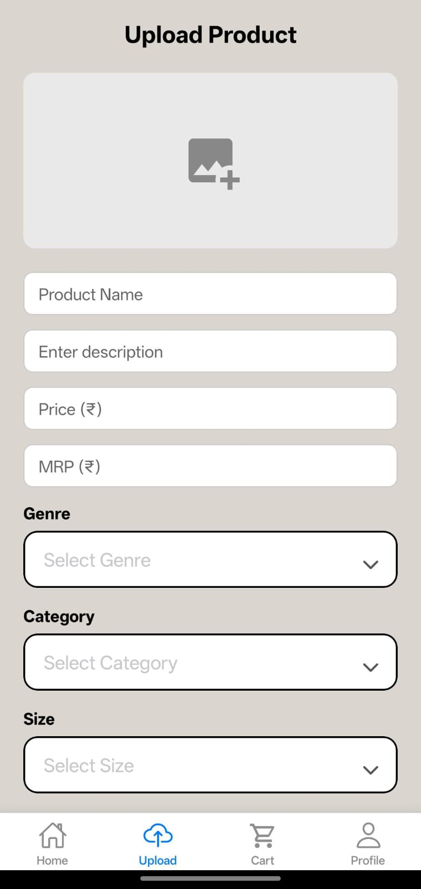

# Drobe 👗🛒

**Drobe** is a mobile fashion marketplace app built using **React Native (Expo)** and **Firebase**.
It allows users to browse, wishlist, and buy fashion items while sellers can upload and manage their own products.

This project was built as a **full-stack mobile application** to gain real-world development experience.

---

## 🚀 Features

* 🏠 Home Screen with gender and image-based category filtering
* 🔍 Product Detail screen with wishlist and cart buttons
* ❤️ Wishlist saved per user
* 🛒 Cart system with checkout
* ⬆️ Upload products (only for registered sellers)
* 🛍️ Seller Dashboard for managing uploaded items
* 💳 Razorpay payment integration
* 🔐 Firebase Authentication for secure login

---

## 🛠️ Tech Stack

| Layer           | Technology           |
| --------------- | -------------------- |
| Frontend        | React Native (Expo)  |
| Backend         | Firebase Firestore   |
| Storage         | Firebase Storage     |
| Authentication  | Firebase Auth        |
| Payments        | Razorpay (Test Mode) |
| Version Control | Git & GitHub         |

---

## 🗂️ Folder Structure (Simplified)

```
/screens        → App screens (Home, Upload, Wishlist, Cart)
/components     → UI components like ProductCard
/context        → Global state (CartContext, AuthContext)
/navigation     → Navigation setup
/assets         → App assets and screenshots
firebaseConfig.js
App.js
```

---

## 📱 App Screenshots





---

## ⚙️ Installation

### 1. Clone the repository

```
git clone https://github.com/Tshuluu/Drobe.git
```

### 2. Navigate to the project folder

```
cd Drobe
```

### 3. Install dependencies

```
npm install
```

### 4. Start the Expo development server

```
npx expo start
```

Then open the app using:

* Expo Go (mobile)
* Android Emulator


---

## 👨‍💻 Author

**Hutshulu Tsutso**
B.Tech Information Technology
Nagaland University
